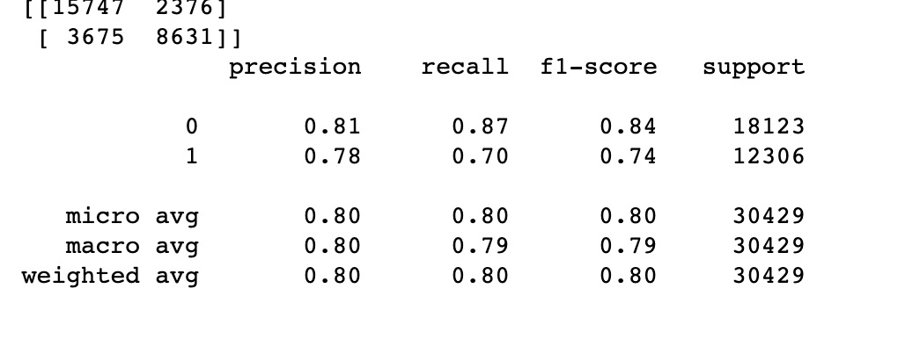

# Project: OCR (Optical Character Recognition) 


### [Full Project Description](doc/project4_desc.md)
Our team is trying to realize the algorithm from paper D3 + C4. 
For the detection part, we firstly constructed features that we can use to define a "garbadge" word. For instance: 
(1) When we delete both the first and the last symbol of a string and the rest contains at least two distinct punctuation symbols, then the string is garbage.
(2) If a string starts and ends with lower-case letters and contains an upper-case letter it is garbage.
(3) A string composed of more than 20 symbols is garbage. 
(4) A string containing at least 3 consecutive occurrences of the same symbol is garbage.
(5) If the number of upper-case letters is larger than the number of lower-case letters and the string contains both types of letters it is garbage.
(6) If a string is only composed of vowels and consonants and the the number of consonants is greater than 8 times the number of vocals, or vice versa, the string is garbage.
(7) If a string contains 4 consecutive vowels or 5 consecu- tive consonants it is garbage.
We extract these features from our training text data and applied the rules mentioned in the following of the paper to assign values to theses features. Finally, we construct the dataframe of these features and use SVM to train our model. 
Our result is quite pleasant: 



Term: Spring 2019

+ Team 3
+ Team members
	+ team member 1
	+ team member 2
	+ team member 3
	+ team member 4
	+ team member 5

+ Project summary: In this project, we created an OCR post-processing procedure to enhance Tesseract OCR output. 
	
**Contribution statement**: ([default](doc/a_note_on_contributions.md)) All team members contributed equally in all stages of this project. All team members approve our work presented in this GitHub repository including this contributions statement. 

Following [suggestions](http://nicercode.github.io/blog/2013-04-05-projects/) by [RICH FITZJOHN](http://nicercode.github.io/about/#Team) (@richfitz). This folder is orgarnized as follows.

```
proj/
├── lib/
├── data/
├── doc/
├── figs/
└── output/
```

Please see each subfolder for a README file.
